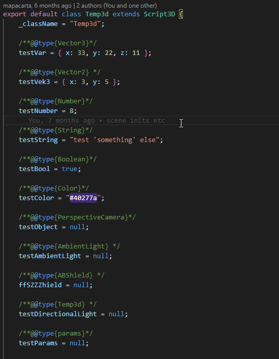
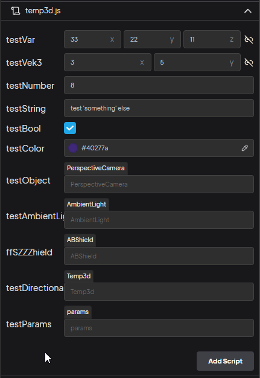

Script içinde public değişkenleri editörden ayarlamak için bir syntax var. Örnekler temp3d.js içinde mevcut.



```js
//doğru
/**@@type{className}*/
variable = val;

//yanlış - @yok, ;eklenmemiş
/**@type{className}*/
variable = val;
```

Özünde [Jsdoc](https://jsdoc.app/) kısmının düzgün çalışması için syntax bu şekilde, olay bir tane daha @ koymak ve val sonrası ; eklemek.

`{className}` kısmına yazılabilen temel desteklenen tipler,
`Number`
`Vector2`
`Vector3`
`Boolean`
`Color`
`Class`
Bunlar tipine göre editörde farklı görünecek.

`{className}` kısmına herhangi bir script ya da class adını da yazabilirsiniz, intellisense çıkması için tepeye importlamayı unutmayın. Importlamanız editörde göstermeyle bağlantılı değil, jsdoc -özetle- intellisense için.



Mesela yukarıdaki `ABShield` kısmı, sahnede ABShield adında scripte sahip objeleri listeleyecektir. Hiç bulamazsa tüm objeleri getirir. Fark şu, ABShield scriptine sahip objeyi bulursa ve seçerseniz, ==objeyi değil, objenin sahip olduğu ABShield Componentini değişkene atayacak==. Karşı tarafın ABShield sınıfındaki değişkenlerini ya da fonksiyonlarını çağırabileceksiniz.

Script haricinde obje tipi olarak da filtreleyebilirsiniz. Mesela yukarıdaki `PerspectiveCamera` temel bir threejs objesi, ama size sahnedeki perspective cameraları getirecektir gibi.
