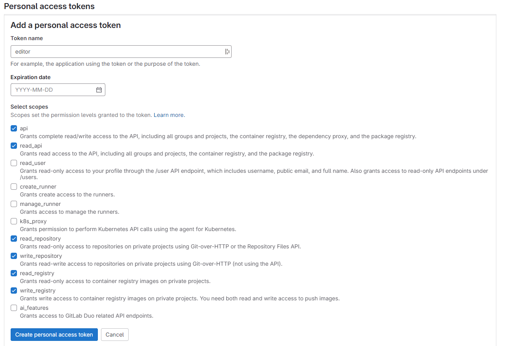
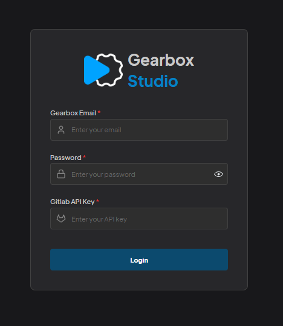
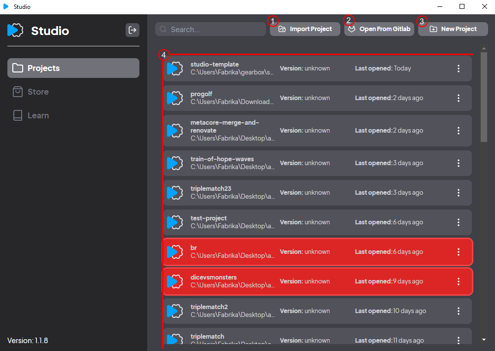

## Setup

Download the latest release from the website.</br>
`Windows`: https://gearbox.playablefactory.com/files/editor/release/studio.exe </br>
`Linux`: https://gearbox.playablefactory.com/files/editor/release/studio.AppImage </br>
`Mac`: </br>

After installing the application, you will login with you gearbox account and gitlab access token.

## Configuring Gitlab

First you need to create a gitlab account if you don't already have one.

Open powershell(windows) or terminal(mac). Type:

```js
cd .ssh
```

If you don't currently have ssh this will return an error, that means you need to create ssh first. Type

```js
ssh-keygen
```

Press enter for all the questions. This will generate ssh files. Now type cd .ssh again. <br>

In the .ssh folder type

```js
cat id_rsa.pub
```

This will return a long string value, copy the entire string including the ssh-rsa part. Open https://gitlab.com/-/user_settings/ssh_keys

Click `Add new key` button, paste the copied string into the Key section. Click the cross in the Expiration date input (this will prevent token to be expired). Click add key button.

<p style="font-weight: bold;font-size: 20px;">Access Token</p>
Now we need to generate an access token for studio to have access the repositories on gitlab. Open <a href="https://gitlab.com/-/user_settings/personal_access_tokens">https://gitlab.com/-/user_settings/personal_access_tokens</a>

Click `Add New Token` on the right.



The name can be anything, hit the cross button in the date section to cancel expiration date. Select scopes just like in the picture. Hit create personal access token.

Copy the generated token, we will use this when logging in to studio.

There is one last thing you need to do about gitlab. You need to clone a repesitory to give access to gitlab servers. Clone this repesitory to some folder:

```js
git clone git@gitlab.com:playablefactory/playables/templates/studio-template.git
```

It will ask you to give access, you should type yes to this.

## Login

Type your gearbox email, password and the generated gitlab token.



## Creating a Project



## 1. Import Project

Use this to import a local studio project. Once you import it you will be able to see the project in the list below.

## 2. Open From Gitlab

Use this to import a studio project from gitlab. Just like importing the project the imported gitlab project will also appear in the project list below.

## 3. New Project

Use this to create a new project. This will create a new gitlab repository with the name you choose. Choose whether it is a 2d or 3d project and the location of the project on your computer. Hit create and open.

## 4. Project List

Here you can see all the projects you worked recently. You can remove a project from the list by clicking the triple dot button and clicking delete.

<div class="important-message">
  <span class="danger-badge">Important</span>
 <p>It will not delete the project from the computer, it just deletes the project from the list.<p>
</div>
