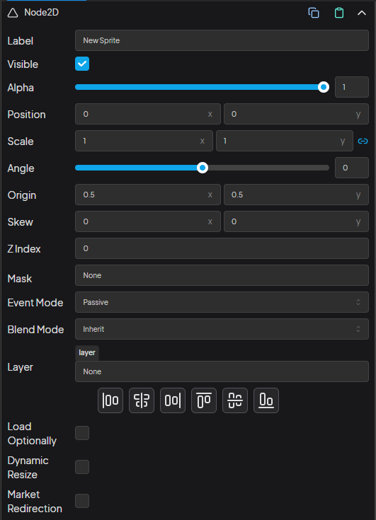

## Node2D Component

<div style="position:relative">
    
    <!-- <div class="hover-box" style="left:-3%; top:6%">
        <div class="title">1</div>
        <div class="body">
            Name of the Object
        </div>
    </div>
    <div class="hover-box" style="left:-3%; top:11%">
        <div class="title">2</div>
        <div class="body">
            Visibility of the Object
        </div>
    </div>
    <div class="hover-box" style="left:-3%; top:15%">
        <div class="title">3</div>
        <div class="body">
            Alpha value of the Object between 0-1
        </div>
    </div>
    <div class="hover-box" style="left:-3%; top:20%">
        <div class="title">4</div>
        <div class="body">
            x,y position of the Object
        </div>
    </div>
    <div class="hover-box" style="left:-3%; top:25%">
        <div class="title">5</div>
        <div class="body">
            x,y scale of the Object
        </div>
    </div>
    <div class="hover-box" style="left:-3%; top:30%">
        <div class="title">6</div>
        <div class="body">
            Angle of the Object in degrees between -180 and 180
        </div>
    </div>
    <div class="hover-box" style="left:-3%; top:36%">
        <div class="title">7</div>
        <div class="body">
            Origin point of the Object
        </div>
    </div>
    <div class="hover-box" style="left:-3%; top:41%">
        <div class="title">8</div>
        <div class="body">
            The skew amount, on the x and y axis.
        </div>
    </div>
    <div class="hover-box" style="left:-3%; top:46%">
        <div class="title">9</div>
        <div class="body">
            Setting this value, will automatically set the parent to be sortable. Children will be automatically sorted by zIndex value; a higher value will mean it will be moved towards the end of the array, and thus rendered on top of other display objects within the same container.
        </div>
    </div>
    <div class="hover-box" style="left:-3%; top:51%">
        <div class="title">10</div>
        <div class="body">
            Sets a mask for the displayObject. A mask is an object that limits the visibility of an object to the shape of the mask applied to it. 
            <br>
            <br>
            For sprite mask both alpha and red channel are used. Black mask is the same as transparent mask.
        </div>
    </div>     -->
</div>


###### Label

Name of the object. This name can be used in the code to get the object.

```js
getObject2D("New Sprite");
```

###### Visible

Controls the visibility of the object.

###### Alpha

Controls the alpha of the object.

###### Position

Controls the x,y position of the object.

###### Scale

Controls the x,y scale of the object.

###### Angle

Controls the angle of the object in degrees. Value is between -180 and 180.

###### Origin

Controls the x,y origin of the object.

###### Skew

The skew amount, on the x and y axis.

###### Z-Index

Setting this value, will automatically set the parent to be sortable. Children will be automatically sorted by zIndex value; a higher value will mean it will be moved towards the end of the array, and thus rendered on top of other display objects within the same container.

###### Mask

Sets a mask for the displayObject. A mask is an object that limits the visibility of an object to the shape of the mask applied to it. 
            
For sprite mask both alpha and red channel are used. Black mask is the same as transparent mask.

###### Event Mode

Enable interaction events for the Container. Touch, pointer and mouse. There are 5 types of interaction settings:

+ **none**: Ignores all interaction events, even on its children.
+ **passive**: (default) Does not emit events and ignores all hit testing on itself and non-interactive children. Interactive children will still emit events.
+ **auto**: Does not emit events but is hit tested if parent is interactive. Same as interactive = false in v7
+ **static**: Emit events and is hit tested. Same as interaction = true in v7
+ **dynamic**: Emits events and is hit tested but will also receive mock interaction events fired from a ticker to allow for interaction when the mouse isn't moving

###### Blend Mode

The blend mode to be applied to the object. Apply a value of 'normal' to reset the blend mode.

###### Layer

The RenderLayer this container belongs to, if any. If it belongs to a RenderLayer, it will be rendered from the RenderLayer's position in the scene.

###### Optional Load

The load optionally parameter makes the object asset only load if selected paremeter set to true in stuffs.js. Check the checkbox and enter some id into the input box next to the checkbox.

Useful for loading an asset based on conditions, for example you may want to show some of the sprites when summer theme is active. Just set the id to summer and the asset will only be loaded if the summer is set to true in the stuffs.js like

```js
results.summer =  true; // or any other true value
```

Be sure to put this line at the very beginnings of the processResults function.

###### Dynamic Resize

Adds dynamic resizing to the object. Check the check box add some id and click the update data.js file. This will generate the necessary fields in the data.js. This will override the responsive component if it is added to the object.

###### Dynamic Offset

It works similarly to the dynamic resize feature. Similarly, we can assign an ID and add it to data.js. The difference is that it runs after the existing resizes (normal and dynamic resize) and is used to apply an offset to the final position and adjust the scale by multiplying it.

###### Market Redirection

When enabled clicking this object will redirect the user to the market.