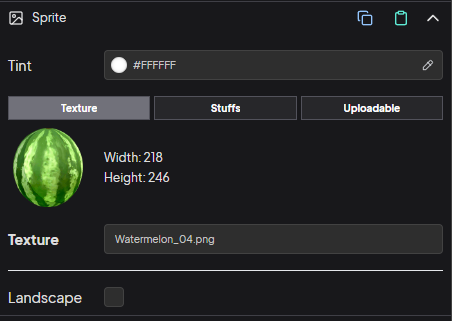

## Sprite Component

    

###### Tint

The tint applied to the object. This is a hex value. 
A value of 0xFFFFFF will remove any tint effect.

###### Texture Selection

There are 3 options for a sprite's texture selection. Texture(Normal), Stuffs, Uploadable.

+ **Texture**: Default option. The selected texture will be used. 
+ **Stuffs**: Select a stuffs image bucket created in the stuffs section. Define a data.js id to control the image. For detail check the stuffs section.
+ **Uploadable**: Choose this option to make the texture uploadable. Choose the default texture, set data.js id and data.js name. Click the Update Data.js button. Studio will handle the rest

###### Landscape
To use different texture for the landscape, enable this option. The texture options are the same for the portrait one.